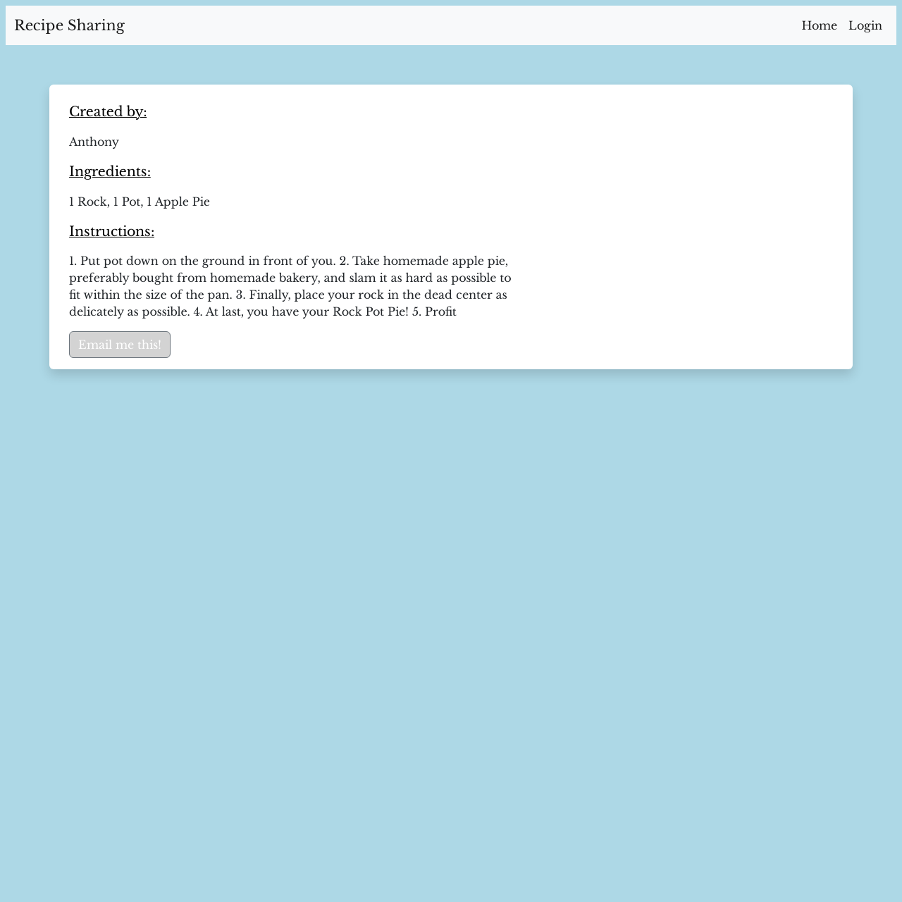

# CWRU Bootcamp Project 2 - Recipe Sharing Website

## Description

1. In this project, our primary goal was to create a recipe-sharing website that would allow the user to log in, create recipes, and add them to a list that is viewable by every user. These recipes could be accessed at a later date, assumedly when the user is cooking!

2. The technologies used for this project were a combination of Express.js, Express-sessions, Handlebars.js, Sequelize, and MYSQL2 all working in tandem to make all of this possible.

3. A big focus of this project was combining all of these concepts relatively seamlessly, which I believe we did!
                                                                       
4. Behind the scenes, we use a package called bcrypt to keep sensitive data safe and encrypted in case of any hack to protect our users.

5. That encrypted data is safely stored in an MYSQL database to be called and displayed on the page using Handlebars.

6. For developmental purposes, we even utilized a new technology in the form of a package called nodemon. This package allowed us to run the server, and when any changes were made to any of the files in the folder, the server would restart on the fly. This removed the need for constantly stopping and starting, speeding up the debugging process tremendously.

7. For the recipes, we allowed the user the ability to delete their recipes after creation, figuring this could be a super helpful feature! 
<br>(just incase they realized that rock pot pie is *_not_* such a good idea)

8. This project was the second collaborative coding effort for this boot camp, and was a great lesson in things like working towards a shared goal in a team, divvying up tasks, and sharing creative problem-solving techniques amongst each other to find success!

## Installation and Usage

<p>Simply download all of the files provided and afterwards create the database called 'recipe_db' using MySQL. Once this is finished, create a .env file following the template provided by .env.example (found within the folder) filling the user and password with your information.

(optional) If you want some initial data to start, we've provided some seeds so you can see the website in action! Just run 'npm run seed' to enable these.

Lastly, all you need to do is run 'npm start' and this will start the service up at 'localhost:3001' on your local network!
<br><br><br>
If you plan to just take a look at functionality, feel free to use the link to the <a href="https://thawing-peak-76333-26c377dd6ea6.herokuapp.com/"> deployed page!</a></p>


## Mockup:
<h3>The following images shows the web application's appearance and functionality:</h3>




## Planned Features:

```
* Ability to edit events once they are posted, instead of needing to completely delete

* Ability to send recipes to specific emails, rather than just the ones tied to accounts

* Ability to upload images that add to the recipe pages

* Extended front-end development to have a broader appeal and really fit that 'cozy food' vibe

* Expanding out the profile, and adding new features like a profile picture, bio, etc. to increase social activity on the site, allowing other users to visit each other's profile

* Adding the ability to like recipes and comment on recipes/profile pages to increase the social aspect of the site

```

## Credits
<br>
  <h3>Editing of code done by Team HMSS 👩🏻‍🍳</h3> <br>
  
  <b>🍰Chad Smith🍰</b><br>
  <b>♨️Sean Moroney♨️</b><br>
  <b>🍖Anthony Iacano🍖</b><br>
  <b>🍝Howard Pifer🍝</b><br>

 <br>
 <h3>Node Packages used in this project: </h3>
 <i>bcrypt<br>connect-session-sequelize<br>dotenv<br>express<br>express-handlebars<br>express-session<br>mysql2<br>nodemailer<br>nodemon<br>path<br>sequelize<br></i>
 <br>
 <h3>CSS Framework(s) used within the project: </h3>
  <i>Bootstrap</i><br>
 <br>
 <h3>Lesson provided by:</h3>
 edX Boot Camps LLC.
 <br>

## Link to Deployed Page

https://thawing-peak-76333-26c377dd6ea6.herokuapp.com/

 ## License

Please reference the **LICENSE.MD** file inside of the repository.

---